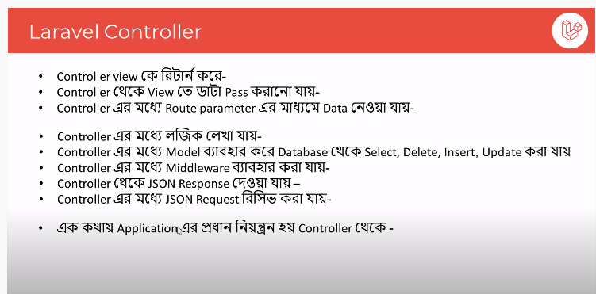
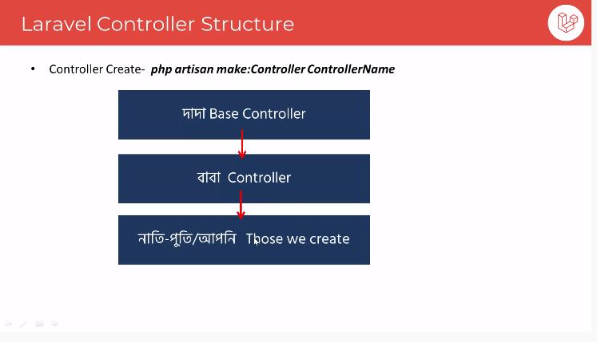
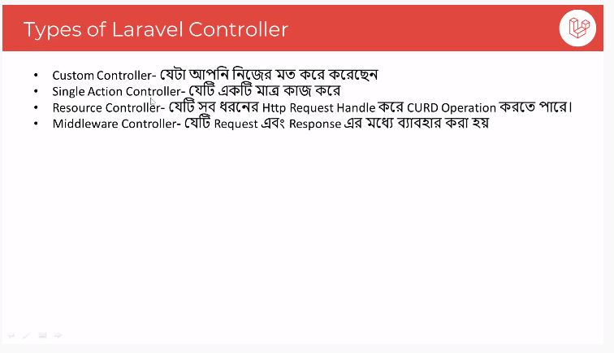

# The Five Basic Concepts of Laravel

* Route
* Model
* View 
* Controller 


### 01. Route:
ধারণত ইংরেজি শব্দ route যাকে অনেক সময় আমরা বাংলায় বলি রুট যার অর্থ দাঁড়ায় গন্তব্যস্থলে পৌঁছানোর রাস্তা। আর Laravel Application এ route হচ্ছে URL থেকে request গ্রহণ করে এবং application কে resource এর জন্য নির্দেশনা প্রদান করে। আরো সহজ ভাবে বলা যায় route হল আপনার অ্যাপ্লিকেশনের একটি request এর বিপরীতে কোন URL টি hit হবে? বা কোথায় থেকে কি response করবে তা নির্ধারণের একটি উপায়। Laravel 5.5 এ সব route গুলো routes ফোল্ডারে তৈরী করা থাকে। এর মধ্যে web application এর route সমূহ routes/web.php তে লিখা হয়। এবং API এর জন্য route সমূহ routes/api.php তে লিখা হয়। Laravel Framework এ route এর সবচেয়ে বড় সুবিধা হচ্ছে আপনি এক যায়গা থেকেই সমস্ত route কে নিয়ন্ত্রণ করতে পারবেন অর্থাৎ পরবর্তিতে route সম্পর্কিত যেকোনো ধরনের পরিবর্তন এখান থেকেই করতে পারবেন।

### Laravel Route এর প্রাথমিক ধারণা
Laravel Route লিখার আগে আপনাকে PHP Anonymous Function, Closure এবং PHP Class এর Static Method সম্পর্কে ধারণা থাকা দরকার, আমরা ধরে নিলাম আপনি এই গুলো জানেন। তো আসা যাক কিভাবে route দিয়ে URL Request গুলো Manage করতে পারি। ধরুন আমাদের Web Application এ তিনটি পেজ আছে , সেগুলো যথাক্রমে Home, About এবং Contact. এখন Web Application ব্যবহারকারী এই তিনটি পেজ এর মধ্যে যাকে request করবে শুধু সংশ্লিষ্ট পেজটি response করবে। অনেকটা নিচের URL এর মত:

* for Home page:
* http://localhost:8000/

* for About page:
* http://localhost:8000/about

* for Contact page:
* http://localhost:8000/contact

 এখন এই তিনটি URL Request এর জন্য আপনি Laravel এর routes/web.php ফাইল এ ঠিক নিচের মত করে লিখতে পারেন।
 
 ```php
 Route::get('/', function (){
    echo "<h2>This is Home Page</h2>;
});
Route::get('/about', function (){
    echo "<h2> This is About Page</h2>";
});
Route::get('/contact', function (){
    echo "<h2> This is Contact Page</h2>";
}); 
 
 ```
 
 ### নোট: অবশ্যই ” php artisan serve ” command দিয়ে server run রাখতে ভুলবেননা।

ব্যাখ্যা: উপরোক্ত উদাহরণে আমরা Route class এর get() মেথডকে call করেছি। Route Class এর get() মেথডটি দুইটি Argument গ্রহণ করে। প্রথম Argument হিসেবে URL Path অর্থাৎ যেই URL এ hit করবে সেটি, এবং দ্বিতীয় Argument হিসেবে একটি Anonymous Function সাথে closure থাকতে পারে। যেমনঃ উপরোক্ত উদাহরণে আমাদের Home URL এর জন্য প্রথম আর্গুমেন্ট হিসেবে শুধু forward slash ( / ) ব্যবহার করি , যার দ্বারা Laravel route রুট ডোমেইনকে নির্দেশ করে। একই ভাবে About URL এর জন্য forward slash সাথে about (/about) এবং Contact URL এর জন্য forward slash সাথে contact(/contact) লিখি। আর তিনটি URL এর জন্যই দ্বিতীয় Argument হিসেবে একটি Anonymous Function ব্যবহার করি যার দ্বারা action কি হবে তা নির্ধারণ করি।

### Laravel Route এবং URL Parameter নিয়ে কাজ
অবশ্যই, কখনও কখনও আপনাকে আপনার route মধ্যে URI এর segment গুলিকে receive বা capture করতে হবে। এটি করার জন্য Laravel Route এ দুটি উপায় আছে যার মাধ্যমে আপনি URL- এর মাধ্যমে পাঠানো Parameter গুলিকে Capture করতে পারেন।

* Required Parameters
* Optional Parameters

### 02. Laravel Model:

যদিও অধ্যায়টির নাম মডেল(Model) দিয়েছি, এটা আসলে এলোকোয়েন্ট মডেল(Eloquent Model) কিন্তু এটাকে শুধু এলোকোয়েন্ট না বলে এলোকোয়েন্ট ওআরএম মডেল(Eloquent ORM Model) বললে সঠিক ভাবে ইন্ডিকেট করা হয়। আর যখনই একবার এটাকে চিনে যাব তখন থেকে আমাদের লারাভেল বন্ধু মহলে শুধুই মডেল(Model) বলে ডাকবো। অনেকটা "মাসনুন ভাই" বা "হাসিন ভাই" এর মতো, একবার চিনে গেলে আর পুরা নামটা বলা লাগে না।

আসুন ব্যাপার গুলোকে একটু ভেঙ্গে ভেঙ্গে বুঝে নেইঃ

### ওআরএম(ORM)
পুরোটা হলো Object Relational Mapping, যা এক ধরনের কায়দা ব্যবহার করে অবজেক্টের মধ্যে রিলেশন তৈরি করে, এই অবজেক্ট গুলো মূলত ডাটাবেজ এর অবজেক্ট। এলোকোয়েন্ট(Eloquent) হলো একটি ওআরএম(ORM) এর নাম, যা একটি একটিভ রেকর্ড(Active Record) এর প্রয়োগ(Implementations)। যেটা লারাভেল এর জন্যই তৈরি করা হয়েছে। এটা অন্যান্য ওআরএম থেকে বেশ শক্তিশালী ও বুদ্ধিমান। ডাটাবেজ নিয়ে কাজ করার সময় আমারা এর নানান কারিশমার সাথে পরিচিত হবো।

### মডেল
মডেল হলো একধরনের ক্লাস যার প্রতিটি অবজেক্ট এক একটি টেবিলের এক একটি রো বা রেকর্ড কে রিপ্রেজেন্ট করে। মনে করি আমাদের একটি টেবিল আছে যার নাম users. এবং যদি এর জন্য একটি মডেল বানাই তার নাম দিবো User. যা users টেবিল এর প্রতিটি রেকর্ড কে রিপ্রেজেন্ট করবে। এখানে একটি মজার নিয়ম আমরা ফলো করবো, টেবিল এর নাম বহুবচন(plural) ও মডেল এর নাম একবচন(singular)। তখন আমরা যে মডেলটি বানাবো, এলোকোয়েন্ট ঠিকই তার টেবিলটি ডাটাবেজ থেকে খুঁজে ম্যাপ করে নিবে। যদি এই নিয়মের অন্যথা হয় তখন মডেল বানানোর সময় টেবিলটির নামটি বলে দিতে হবে।
আমরা এলোকোয়েন্ট ওআরএম ব্যবহার করে টেবিলে Create, Edit, Delete, Select এবং আরও অনেক কিছুই করতে পারবো কোনও SQL statement না লিখেই। আপনি কি রিলেশনাল ডাটাবেজ এর কথা ভাবছেন? হ্যাঁ, সেটাও আমরা এই সিস্টেম এর মধ্যেই করে ফেলবো!!


### 03. View: 

ভিউ পার্টের মধ্যে আপনার অ্যাপ্লিকেশনের সাধারনত HTML কন্টেন্ড গুলো থাকে, এবং কন্ট্রোলার ও মডেল(বিজনেস লজিক) সেপারেট করার এটি একটি ভাল পদ্ধ্যতি। ভিউস ফাইল গুলো resources/views ডিরেক্টরিতে থাকে। নিচে একটা খুব সাধারণ উধাহরন দেয়া হলঃ
 
 ```php
 <!-- View stored in resources/views/welcome.php -->
<html>
    <body>
        <h1>Hello, <?php echo $name; ?> Welcome to the laravel world!</h1>
    </body>
</html>
```
ভিউ ফাইলটি ব্রাউজারে দেখতে চাইলে নিচের ন্যায় কোডটি route এ লিখতে হবে।

```php
Route::get('/', function()
{
    return view('welcome', ['name' => 'Sohel Amin']);
});

```
ভিউস ডিরেক্টরির মধ্যে নেস্টেট সাব-ডিরেক্টরি থাকতে পারে। উধাহরন হিসেবে বলা যায় আপনি যদি ভিউ ফাইলটিকে এইভাবে রাখেনঃ resources/views/admin/profile.php তাহলে আপনাকে নিম্নের ন্যায় ভিউ হেল্পার মেথডটিকে কল করতে হবেঃ

```php
return view('admin.profile', $data);

```

এখন আমি আপনাদেরকে কিভাবে ভিউ ফাইলের মধ্যে ডাটা পাস করতে হয় সেটা সম্পর্কে ধারণা দিব। আপনারা হয়ত খেয়াল করেছেন ভিউ মেথডটি কল করার সময় আমি দ্বিতীয় প্যারামিটার সহ দেখিয়েছি।

```php
return view('admin.profile', $data);

```

এখানে দ্বিতীয় প্যারামিটার $data দিয়ে অ্যারে পাস করা হয়েছে। এইক্ষেত্রে ভিউ ফাইলের মধ্যে আপনি ডাটা অ্যাকসেস করতে চাইলে $data এর পরিবর্তে আপনাকে $data অ্যারে এর ইনডেক্স কে কল করতে হবে। কারন কন্ট্রোলার অথবা রাউট থেকে ডাটা পাস করার সময় অ্যারে সয়ংক্রিয় ভাবে ভিউতে গিয়ে ভেরিয়েবল এ রুপান্তরিত হয়। আপনি যেকোনো ভিউ ফাইলকে চাইলে ভেরিয়েবেলের মধ্যে রাখতে পারেন এবং সেটি অন্য কোন ভিউ ফাইলে ইকো (echo) করতে পারেন। যেমন ধরুন আপনি কন্টাক্ট ফর্ম অথবা অন্য কিছু ছোট আকারের কোড একটা ভিউ ফাইলের মধ্যে রেখে দিয়েছেন আর অন্য ভিউ ফাইলে এইটা দেখাইতে চাচ্ছেন তাহলে আপনাকে নিচের মত করে লিখতে হবে।


```php
$view = view('welcome', $data);

```

ভিউ ফাইলে অ্যারে পাস করা ছাড়াও আমরা লারাভেলের প্রচলিত নিয়মে ডাটা পাস করতে পারি আর এইজন্য নিচের ন্যায় লিখতে হবে।

```php

// Using conventional approach
$view = view('welcome')->with('name', 'Sohel Amin');


```

এটা ছাড়াও আমরা ম্যাজিক মেথড ব্যাবহার করতে পারি যেটা আমাদেরকে আরেক রকম ভিন্ন স্বাদ দিবে।

```php

// Using Magic Methods
$view = view('welcome')->withName('Sohel Amin');

```

ধরুন এখন আপনি নাম এর পরিবর্তে ইমেইল পাস করবেন তাহলে আপনাকে নিচের মত করে লিখতে হবে।

```php
$view = view('welcome')->withEmail('sohelamin@example.com');

```
আপনি চাইলে নাম আর ইমেইল একসাথে লিখতে পারেন।

```php

return view('welcome')->withName('Sohel Amin')->withEmail('sohelamin@example.com');

```

এখন আপনি ভিউ ফাইলে যেভাবে ডাটা অ্যাকসেস করবেন সেটা নিচে দেখান হল।

```php
<!-- View stored in resources/views/welcome.php -->
<?php
    var_dump($name);
    var_dump($email);
?>

```

এছাড়াও আপনি আপনার ডাটা কিংবা অ্যারে সব ভিউ ফাইলের সাথে শেয়ার করতে পারবেন এইভাবে।

```php

view()->share('data', [1, 2, 3]);

```

### 04.Controller: 








### Laravel essential command


| Command | Description |
| --- | --- |
| `php artisan serve` | To Run Laravel Application |
| `php artisan make:controller ControllerName ` | To Make New Controller |
| `php artisan make:Model ModelName` | To Make New Model|
| `php artisan make:Middleware MiddlewareName` | To Make Middleware Class|
| `php artisan make:migration tablename` | To Make migration File |
| `php artisan migrate` | To Run migrate |

### Laravel clear cache essential command

| Command | Description |
| --- | --- |
| `php artisan cache:clear` | Clear Application Cache |
| `php artisan route:clear ` | Clear Route Cache |
| `php artisan config:clear ` | Clear Config Cache |
| `php artisan view:clear ` | Clear Compiled View Files|


### Laravel -Application Necessary Folder Structure:

* App->Http->Controllers
* App->Http->Middleware
* bootstrap->cache.php
* Config->cache.php,session.php,mail.php,view.php
* database->migrations
* public->.htaccess,favican.ico,robots.txt(google Search),index.php(Run Application)
* resources->js,lang,sass,views(welcome.blade.php)
* routes->web.php,api.php
* .env-(enverment variable, Database Connection)
* composer.json-> install package/libraries info
* package.json-> package info


